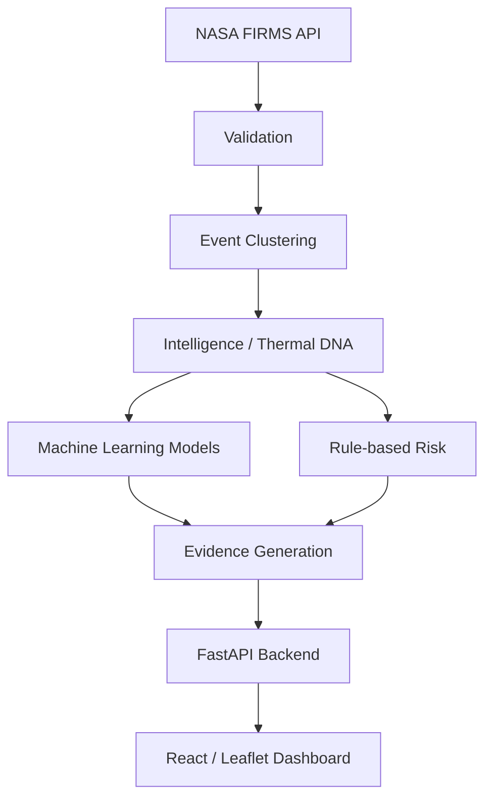

# IGNIS / ThermalWatch AI

**SIH 2026 Problem Statement:** SIH26162
**Sponsor:** National Technical Research Organisation (NTRO)

**IGNIS** is a thermal event investigation prototype. It validates NASA FIRMS VIIRS observations, groups nearby detections into spatial and temporal events, extracts a Thermal DNA feature signature, and presents separate anomaly, rule-based risk, and weak recurrence signals with SHA-256 evidence. 

## Architecture

**Pipeline flow:** FIRMS → Validation → Clustering → Intelligence → ML → Risk → Evidence → API → Dashboard



**Key Technology Stack:**
- Python 3.11+ / FastAPI
- React / Node.js 18+ / TypeScript / Vite / Leaflet
- PostgreSQL 15 + PostGIS 3.3 (optional but recommended)
- scikit-learn (Isolation Forest, Random Forest)

## Quick Start

### Prerequisites
- Python 3.11+
- Node.js 18+
- Git

### Clone Repo
```bash
git clone <repository_url>
cd Thermal_Watch_AI
```

### Backend Setup
```powershell
cd backend
py -3.11 -m venv .venv
.\.venv\Scripts\python.exe -m pip install -r requirements.txt
Copy-Item .env.example .env
```

### Frontend Setup
```powershell
cd frontend
npm install
```

### Running in Snapshot Mode (no PostgreSQL needed)
By default, the backend can run using a captured FIRMS snapshot CSV:
```powershell
cd backend
.\.venv\Scripts\python.exe -m uvicorn app.main:app --host 127.0.0.1 --port 8000
```
Then run the frontend:
```powershell
cd frontend
npm run dev
```

### Running with PostgreSQL + PostGIS
1. Make sure `FIRMS_SNAPSHOT_PATH` is empty in `.env`.
2. Start the database (see [PostgreSQL + PostGIS Setup](#postgresql--postgis-setup)).
3. Initialize the DB: `.\.venv\Scripts\python.exe -m app.db.init_db`
4. Run the API and frontend as usual.

## Environment Variables

| Variable | Description | Default | Required/Optional |
|----------|-------------|---------|-------------------|
| APP_ENV | Application environment | development | Optional |
| LOG_LEVEL | Logging level | INFO | Optional |
| API_HOST | Host to bind the API | 0.0.0.0 | Optional |
| API_PORT | Port to bind the API | 8000 | Optional |
| CORS_ORIGINS | Allowed CORS origins | http://localhost:3000 | Optional |
| DEMO_MODE | Enable synthetic demo data | false | Optional |
| ML_MODEL_PATH | Path to trusted ML artifact | | Optional |
| ML_CLASSIFIER_PATH | Path to recurrence artifact | models/firms_recurrence.joblib | Optional |
| DATABASE_URL | PostGIS connection string | | Optional (Req for DB mode) |
| FIRMS_MAP_KEY | NASA FIRMS API Map Key | | Required (Live mode) |
| FIRMS_SATELLITE | Sensor to query | VIIRS_NOAA20_NRT | Optional |
| FIRMS_AREA | Bounding box (W,S,E,N) | 68,6.5,97.5,35.5 | Optional |
| FIRMS_DAYS | Days of historical data | 5 | Optional |
| FIRMS_SNAPSHOT_PATH| Path to snapshot CSV | | Optional |
| CLUSTER_DISTANCE_METERS | Distance for grouping | 1000 | Optional |
| CLUSTER_TIME_HOURS | Time for grouping | 72 | Optional |
| PERSISTENCE_MIN_DETECTIONS | Min detections for persistent | 3 | Optional |

## NASA FIRMS Setup

1. **Get API Key:** Register free at https://firms.modaps.eosdis.nasa.gov/api/map_key/
2. **Capture Data:** Add your `FIRMS_MAP_KEY` to `.env`. Run:
   ```powershell
   .\.venv\Scripts\python.exe -m app.ingestion.capture
   ```
3. **Use Saved Captures:** Ensure `FIRMS_SNAPSHOT_PATH` points to the saved capture CSV.

## PostgreSQL + PostGIS Setup

### Option 1: Docker
A `docker-compose.yml` is provided at the root:
```bash
docker-compose up -d
```

### Option 2: Native Install
Install PostgreSQL 15 and PostGIS 3.3 natively. Create the database and run `CREATE EXTENSION postgis;`.

### Schema Creation
Initialize the DB schemas by running:
```powershell
cd backend
.\.venv\Scripts\python.exe -m app.db.init_db
```

### Data Ingestion
If using the database, data can be ingested from a snapshot or fetched directly via live ingestion.

## Machine Learning

- **Anomaly Detection (Isolation Forest):** Unsupervised model. Ranks unusual event patterns in the capture.
- **Recurrence Classifier (Random Forest):** Weakly supervised later-day re-detection classifier, trained on real FIRMS event clusters.

### Training Pipeline
```powershell
cd backend
.\.venv\Scripts\python.exe -m app.ml.train_anomaly
.\.venv\Scripts\python.exe -m app.ml.train_weak_firms
```

### Honest Evaluation Metrics Note
The current holdout has 19 events and ~52.6% accuracy. This is a research prototype, not an operational alert model.
- **What they claim:** Ranks unusual events and identifies recurrent spatial-temporal signatures based on historical snapshots.
- **What they do NOT claim:** They do NOT classify fire cause, nor estimate true fire probability. Uncalibrated output.

## Evidence Verification & Blockchain Anchoring

- **SHA-256 Package Integrity:** Event data and metadata are deterministically canonicalized and hashed into a tamper-evident package (`GET /evidence/{event_id}`).
- **Local Audit Chain:** Local chained receipts with previous-hash linking stored in `data/evidence_local_chain.jsonl`. Verified via `GET /evidence/{event_id}/verify`.
- **EVM Testnet Anchoring:** Supports public EVM testnets (e.g. Ethereum Sepolia) via [`ThermalWatchAnchor.sol`](backend/contracts/ThermalWatchAnchor.sol).
  - Smart contract function: `anchorEvidence(bytes32 evidenceHash, uint256 eventId)`
  - Verification query: `verifyEvidence(bytes32 evidenceHash)`
  - Deploy script: `python scripts/deploy_anchor_contract.py`
  - Endpoints: `POST /evidence/{event_id}/anchor-blockchain`, `GET /evidence/{event_id}/verify-blockchain`, `GET /blockchain/status`.
  - **Graceful Fallback:** If blockchain is not configured or testnet RPC is unavailable, the system automatically operates on the local SHA-256 chain and clearly reports: *"Blockchain unavailable — local evidence verification active."* No transaction hashes are ever fabricated.


## API Reference

- `GET /health` : Health check and service status
- `POST /ingestion/firms/run` : Trigger FIRMS data ingestion
- `GET /thermal-events` : List detected thermal events
- `GET /thermal-events/{id}` : Get a single thermal event detail
- `GET /history/event/{event_id}/profile` : Get Thermal DNA profile
- `GET /evidence/{event_id}/verify` : Verify data receipt hashes

## Frontend

- **Pages:** Dashboard, Events, Event Detail, Analytics, Risk, Model, Evidence, Health
- **Modes:** Dark / Light mode toggle
- **Map:** Leaflet integration showing VIIRS detections and event clusters

## Testing

- **Backend:** 
  ```powershell
  cd backend
  .\.venv\Scripts\python.exe -m pytest tests
  ```
- **Frontend:** 
  ```powershell
  cd frontend
  npm run build
  ```
- **E2E:** `verify_full_system.py` (if available)

## System Limitations

Be honest about:
- **Satellite detection ≠ fire cause:** Thermal detections are not ground-truth labels.
- **ML limitations:** The models are uncalibrated and accuracy is weak.
- **No blockchain mainnet:** Evidence hashes are stored locally only.
- **Weak classifier performance:** Currently performing just above random chance.
- **PostGIS optional:** Snapshots are used primarily instead of live database persistence in the prototype.

## Glossary

- **FIRMS Detection:** A single anomalous thermal reading from the VIIRS sensor.
- **Thermal Event (cluster):** A spatiotemporal group of detections considered part of the same physical incident.
- **Thermal DNA:** A behavioral fingerprint summarizing temporal, intensity, and spatial patterns of an event.
- **Anomaly Score:** Output of the unsupervised isolation forest highlighting unusual patterns.
- **Recurrence Prediction:** A weak-label classifier output guessing if a spot will be active on a later day.
- **Risk Score:** A rule-based operational heuristic (not a probability) to prioritize analyst review.
- **Evidence Hash:** SHA-256 fingerprint generated over the event payload for auditability.
